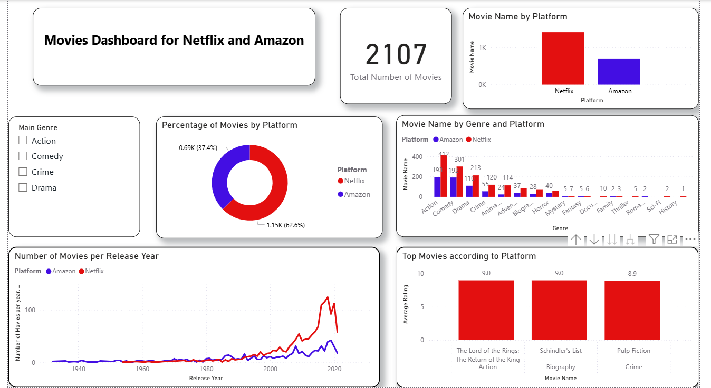

# 🎬 Netflix-Amazon-Dashboard  

This project is a **Power BI dashboard** that analyzes and visualizes movies available on **Netflix** and **Amazon Prime**.  
It provides insights into the number of movies, genres, release trends, and top-rated films across both platforms.  

---
## 📊 Dashboard Preview

## 📊 Dashboard Features  

- **Total Movies Overview**  
  The dataset contains **2,107 movies** across both platforms.  

- **Platform Comparison**  
  - Netflix hosts around **62.6% (1,150+)** movies  
  - Amazon covers **37.4% (~690)** movies  

- **Genre Distribution**  
  Comedy, Action, and Drama dominate as the leading genres. Smaller categories include Family, Thriller, Fantasy, and Sci-Fi.  

- **Release Year Trends**  
  A time-series view shows how movie releases have grown.  
  A sharp rise is observed after 2000, peaking around 2020.  

- **Top Movies** (based on ratings):  
  - *The Lord of the Rings: The Return of the King* (Action, 9.0)  
  - *Schindler’s List* (Biography, 9.0)  
  - *Pulp Fiction* (Crime, 8.9)  

---

## 🛠️ Tools & Dataset  

- **Power BI** – used to design and develop the dashboard  
- **Dataset** – includes platform, genre, release year, and average rating for each movie  

---

## 🎯 Key Insights  

- Netflix has a wider collection compared to Amazon.  
- Audience preferences lean heavily toward Action, Comedy, and Drama.  
- The streaming boom in the 2000s contributed to a rapid increase in available movies.  
- A handful of timeless classics still hold the top ratings across platforms.  

---

## ▶️ How to Run  
-Install Power BI Desktop (free from Microsoft).
-Clone this repository to your local machine.
-Open the Movies_Dashboard.pbix file in Power BI Desktop.
-Use the genre filters to explore movies by category.
-Interact with the charts to compare platforms, genres, release years, and ratings
